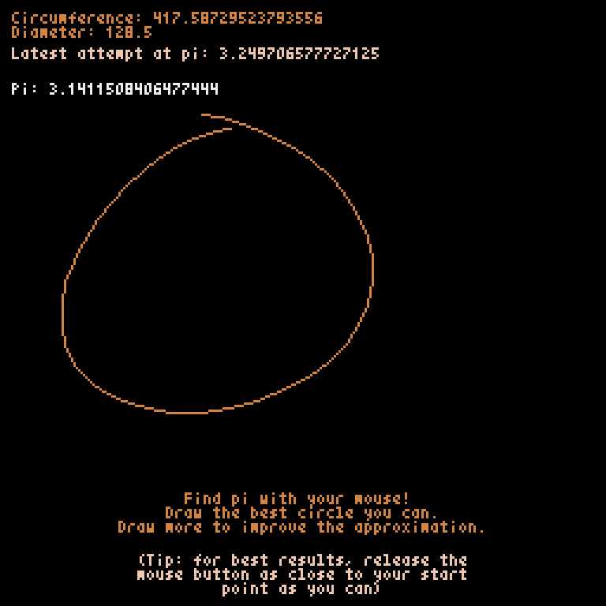

DrawPi
======

Find the value of pi by drawing a circle! Great for when you forget all the digits. Celebrating Pi Day 2023.

Select the picture to see an animated demo.

Install and use
---------------
This program requires Python 3.10 or higher and `Pyxel <https://github.com/kitao/pyxel>`_. The dependencies are also listed in the Poetry section of `<pyproject.toml>`_.

To install using Poetry::

  poetry install

To install without Poetry::

  pip install pyxel
  
Then run the program by launching `<drawpi.py>`_::

  python drawpi.py

License and copyright
---------------------
Copyright © 2023 JonLiuFYI

The source code of DrawPi, the ``.py`` files, is released under the Apache 2.0 License. See `<LICENSE>`_.

The images in the DrawPi directory, `<demo.gif>`_ and `<screenshot.png>`_, are licensed under `CC BY 4.0 <https://creativecommons.org/licenses/by/4.0>`_.